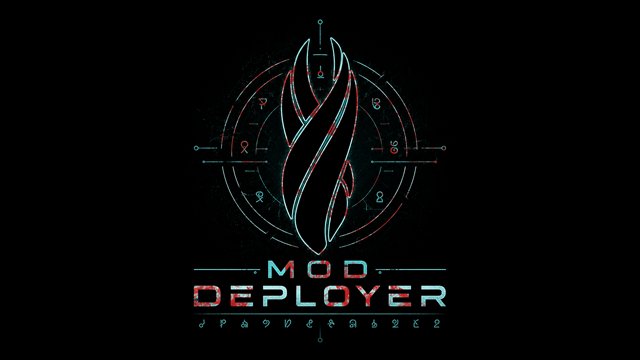

<div align="center">



# MOD DEPLOY MANAGER

<p>
  
  
  
  
  
  
</p>

<p><i>A cinematic deployment utility for game modding workflows — designed with a Dead Space-inspired interface and focused on safe, traceable file deployment.</i></p>

</div>

---

## Overview

**MOD DEPLOY MANAGER** is a standalone deployment utility for modded game environments. It was designed for workflows where large batches of files must be copied into a game's `Data` directory while preserving rollback safety and deployment visibility.

Instead of manually dragging files into the game folder and risking overwrites, the tool automates the entire process:

- scans the source directory
- removes empty files and folders
- creates timestamped backups of replaced files
- deploys new assets into the game
- logs every operation in real time
- restores previous deployments from backup snapshots

The application is wrapped in a custom sci-fi UI inspired by the inventory systems and holographic interfaces of the Dead Space franchise.

---

## ✦ Features

<table>
<tr>
<td width="50%" valign="top">

### 📦 Automated Deployment
Deploys entire mod packages directly into the target game's `Data` directory. Existing files are automatically detected and replaced.

### 🛡 Backup System
Before overwriting any existing asset, the application creates a timestamped backup inside `_ModBackup`. Each deployment session is isolated into its own restore point.

### 🔄 Restore Support
Previous backups can be restored directly through the interface. Useful for reverting broken mods, testing asset combinations, or recovering from conflicts.

### 🧹 Automatic Cleanup
The deploy pipeline scans the source folder for:

- zero-byte files
- empty directories
- redundant junk entries

These are removed before deployment begins.

</td>
<td width="50%" valign="top">

### 📜 Live Deployment Log
A realtime logging console tracks all operations:

- deployed files
- skipped files
- created backups
- cleanup operations
- restore actions
- errors and warnings

### 🎨 Dead Space Interface
Custom PyQt6 interface featuring:

- Unitology typography
- holographic orange-blue palette
- sci-fi styled panels
- cinematic progress indicators
- custom title bar and navigation elements

### 🧵 Background Worker Thread
Deployment and restore operations run in a separate `QThread`, keeping the UI responsive during long file operations.

</td>
</tr>
</table>

---

## ⚙ Deployment Workflow

```text
1. Select source mod directory
2. Select game root folder
3. Application validates game/Data structure
4. Empty files and directories are removed
5. Existing game files are backed up
6. Modified files are deployed
7. Deployment log and progress bar update in realtime
8. Restore points remain available for rollback
```

---

## 📁 Backup Structure

Each deployment creates a unique timestamped backup:

```text
<GameFolder>
└── _ModBackup
    └── 2026-05-14_21-48-03
        └── Data
            └── ... backed up files
```

This allows multiple deployments to coexist safely without overwriting previous restore states.

---

## 🛠 Tech Stack

| Layer | Technology |
|---|---|
| **UI framework** | PyQt6 |
| **Language** | Python 3 |
| **Hashing** | hashlib SHA-256 |
| **Threading** | QThread |
| **File operations** | shutil + os |
| **Typography** | Montserrat + Dead Space Unitology |
| **Packaging target** | Windows standalone executable |

---

## 📁 Project Structure

```text
MOD_DEPLOY_MANAGER/
├── main.py                     Entry point
├── config.py                   Application metadata and colour palette
├── styles.py                   Fonts, QSS stylesheets, reusable widgets
├── worker.py                   Deployment thread and filesystem helpers
├── window.py                   Main application window
├── app_icon.PNG                Application icon
├── Montserrat-Medium.ttf       Main UI font
└── DeadSpace Unitology.ttf     Decorative Unitology font
```

---

## 🚀 Running from source

```bash
pip install PyQt6
python main.py
```

Requires:

- Python 3.10+
- Windows
- write access to the selected game directory

---

## 📌 Intended Use Cases

- Large texture replacement packs
- Total conversion deployments
- Asset testing workflows
- Iterative game mod development
- Modpack validation and rollback
- Fast switching between deployment states

---

## 📜 License

License: **PROPRIETARY**

This software is distributed as a personal proprietary utility.

Modification, redistribution, sublicensing, reverse engineering, or commercial reuse of this software or its assets without explicit written permission from the author is prohibited.

© 2026 Mark de Rune. All rights reserved.

---

## 🔤 Third-Party Fonts

This project includes and uses the following third-party fonts:

- **Dead Space Unitology**
- **Montserrat Medium**

All respective trademarks, font names, and related intellectual property belong to their respective owners.

These fonts are used exclusively for visual styling and interface presentation within this non-commercial project. The project is not affiliated with, endorsed by, or sponsored by Electronic Arts, Visceral Games, or the original font authors.

The fonts are distributed solely as embedded application assets for non-commercial use. If any rights holder requests removal or replacement of specific assets, they will be addressed accordingly.

---

<div align="center">

</div>
